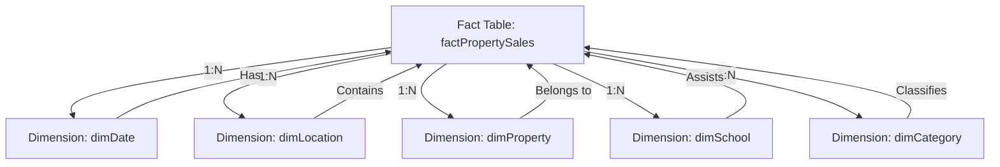

```mermaid
  graph TD
    A[Fact Table: factPropertySales]
    B[Dimension: dimDate]
    C[Dimension: dimLocation]
    D[Dimension: dimProperty]
    E[Dimension: dimSchool]
    F[Dimension: dimCategory]

    A -->|1:N| B
    A -->|1:N| C
    A -->|1:N| D
    A -->|1:N| E
    A -->|1:N| F

    %% Relationships
    B -->|Has| A
    C -->|Contains| A
    D -->|Belongs to| A
    E -->|Assists| A
    F -->|Classifies| A
```